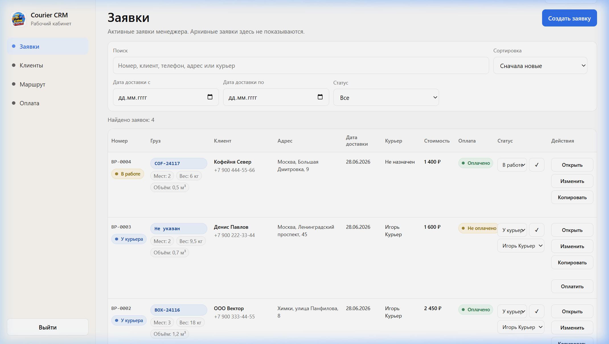

# crm-courier

Заявки теряются в чатах и таблицах, статусы приходится спрашивать вручную, по деньгам нет общей картины.

> ### crm-courier показывает, кто что везёт, что оплачено и сколько начислить курьерам.

## [Открыть CRM](https://qxstayone.pythonanywhere.com)

Это публичная витрина закрытой CRM заказчика. Код и база закрытого проекта не публикуются.

## Что внутри

- Заявки с ценой, статусом и назначенным курьером.
- Клиенты и история заказов.
- Маршрут и список доставок.
- Кабинет курьера с выплатами.
- Оплаты, задолженности и итог по деньгам.

## Кому подойдёт

Небольшая курьерская служба, доставка, локальный сервис с ручным учётом.

## Стек

Python 3.12, FastAPI, Jinja2, SQLAlchemy 2.0, SQLite/PostgreSQL, Docker.
